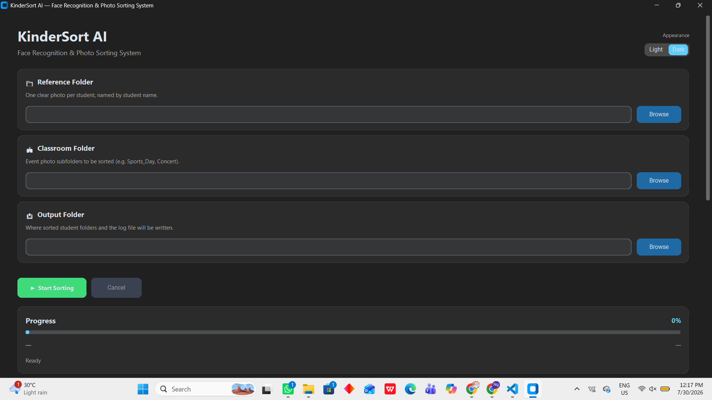
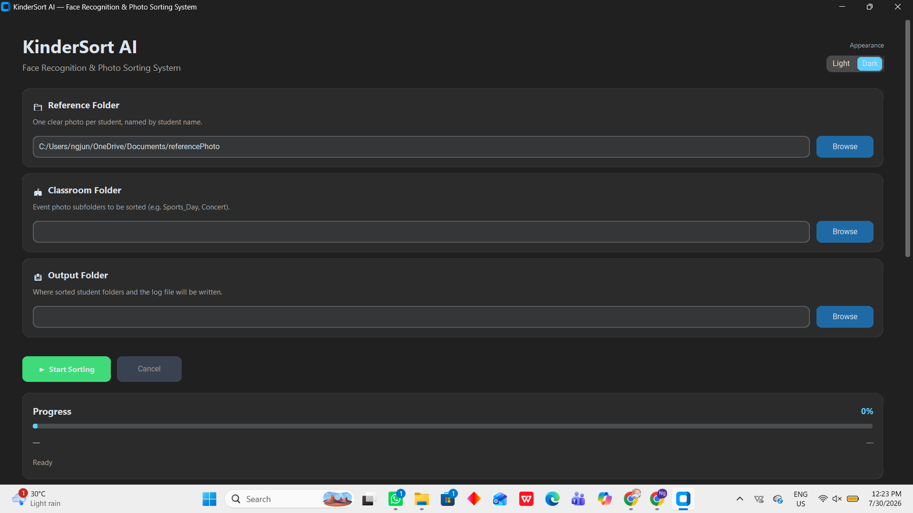
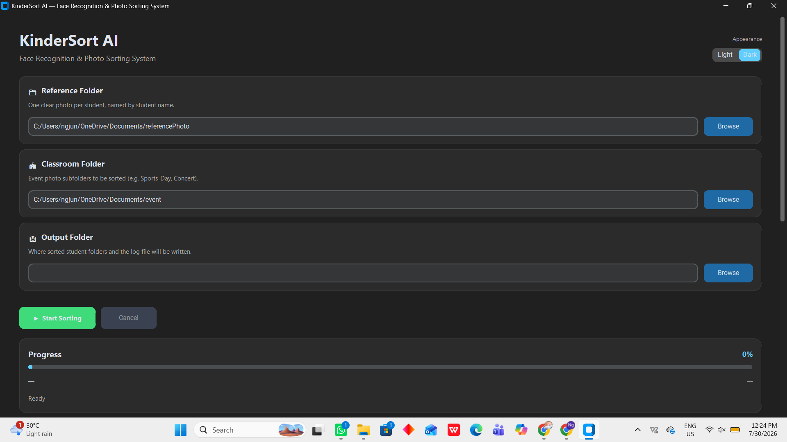
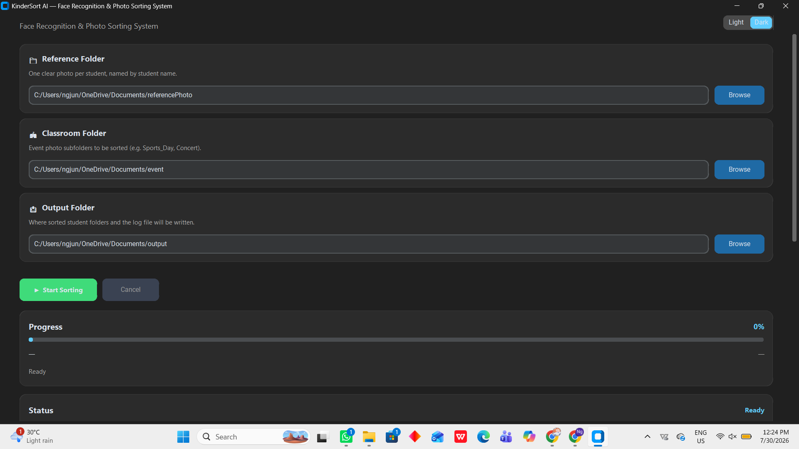
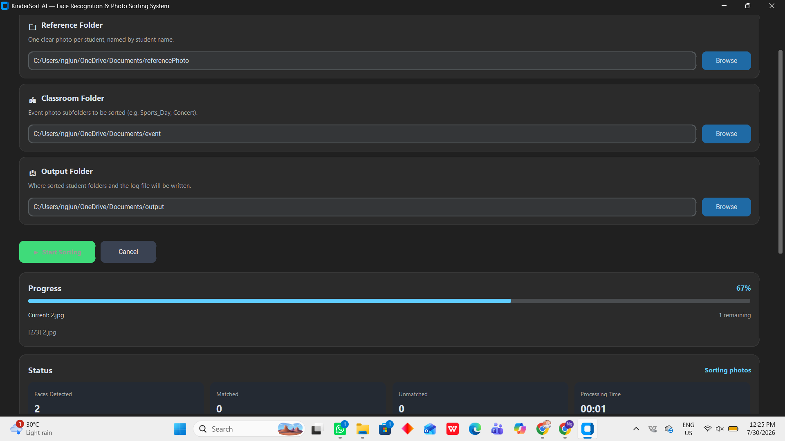
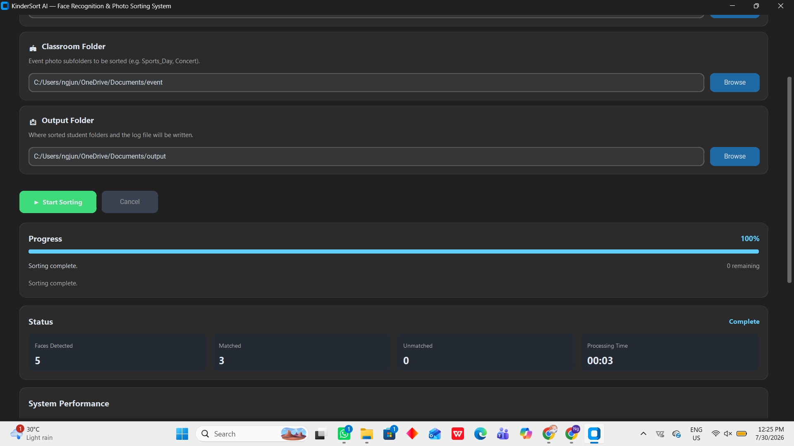

# KinderSort — Student Photo Organiser

[](https://github.com/lerlerchan/KinderSort/releases)
[](https://www.python.org/)
[](https://github.com/lerlerchan/KinderSort)
[](https://github.com/lerlerchan/KinderSort/releases)

[中文说明 (简体)](README.zh-CN.md)

KinderSort is a desktop app for kindergarten teachers. It scans classroom event photos, detects and recognises student faces against a reference folder, and copies each photo into the correct student's output folder automatically — no coding knowledge required.

---

## Project Overview

Sorting hundreds of event photos by hand — and figuring out which child appears in which photo — is slow and error-prone. KinderSort automates this with a local, **CPU-only** face detection and recognition pipeline, wrapped in a **CustomTkinter** point-and-click interface.

On launch, the GUI appears immediately while AI models load in the background. Once ready, the teacher selects three folders (Reference, Classroom, Output), clicks **Start Sorting**, and reviews live progress plus a completion summary. Matched photos are copied into per-student folders; photos with no recognisable match or no detectable face are copied into `_unmatched/`. Original files are never moved or deleted.
[](https://github.com/ngjunjie070624-cpu/KinderSort/releases)
---

## Features

| Feature | Detail |
|---|---|
| Automatic face detection & sorting | Detects faces in event photos, matches them to reference students, copies photos into `Output/<StudentName>/` |
| Group photo support | One photo is copied to every matched student's folder |
| Unmatched handling | Photos with no face, no embedding, or no confident match go to `Output/_unmatched/` |
| CPU-only inference | All models run via ONNX Runtime on CPU — no GPU required |
| CustomTkinter GUI | Windows 11–styled interface with Light/Dark mode, progress bar, status panel, and run summary |
| Fast startup | Window appears immediately; YOLOv8, InsightFace, and ONNX Runtime load in a background thread |
| Live status panel | Tracks faces detected, matched count, unmatched count, and elapsed processing time |
| System Performance panel | Eight real-time process metrics (CPU, memory, timing) via `psutil` during each sort run |
| Safe file handling | Photos are **copied**, never moved or deleted — originals stay intact |
| Audit trail | Detailed run log written to `kindersort_log.txt` in the output folder |
| Cancel-safe | Sorting can be cancelled mid-run; photos already processed are kept |
| Multiple reference photos | Root-level `StudentName.jpg` files or `Reference/StudentName/` subfolders with several images per student |

---

## AI Architecture

```
 Reference photos ─┐
                    ├─▶ Face Detector (YOLOv8 optional → InsightFace SCRFD fallback) ─▶ bounding boxes
 Event photos ──────┘
                                       │
                                       ▼
                     Face Recognizer (InsightFace ArcFace, buffalo_l)
                                       │
                            512-d L2-normalized embedding
                                       │
                                       ▼
                 Cosine-distance match against each student's
                 reference embedding(s) — closest student under
                 distance threshold 0.55 (and clear of near-ties) wins
                                       │
                                       ▼
                    Matched photo copied to Output/<StudentName>/
                    (multiple folders for group photos);
                    no match / no face → Output/_unmatched/
```

**Detection (`face_detector.py`):** Tries a YOLOv8 face model (`yolov8n-face.pt`) when the weights file is present and valid. If the weights are missing, invalid, or not a face-trained model, the pipeline automatically falls back to **InsightFace SCRFD** (CPU, ONNX Runtime). Both paths return `(x1, y1, x2, y2)` bounding boxes.

**Recognition (`face_recognizer.py`):** Uses InsightFace's **`buffalo_l`** bundle with **ArcFace** to produce a 512-dimensional, L2-normalized embedding per detected face.

**Matching (`sorter.py`):** Compares each event-photo embedding to every stored student reference via cosine distance. The closest match under threshold `0.55` is accepted; ambiguous near-ties (margin `< 0.02`) are rejected. Reference photos with multiple faces use the largest detected face as the student.

**Image preprocessing:** Event and reference images are resized so the longest side is at most 1000 px before detection, reducing CPU load without materially affecting accuracy.

---

## Technologies Used

[](https://opencv.org/)
[](https://github.com/deepinsight/insightface)
[](https://github.com/ultralytics/ultralytics)
[](https://onnxruntime.ai/)
[](https://github.com/TomSchimansky/CustomTkinter)
[](https://github.com/giampaolo/psutil)
[](https://pyinstaller.org/)

| Component | Library / detail |
|---|---|
| Face detection | InsightFace SCRFD (default fallback) / Ultralytics YOLOv8 (optional, `yolov8n-face.pt`) |
| Face recognition | InsightFace ArcFace (`buffalo_l`), via ONNX Runtime (`CPUExecutionProvider`) |
| Image handling | OpenCV, Pillow |
| GUI | CustomTkinter |
| Resource monitoring | psutil (`perf_monitor.py`) |
| Packaging | PyInstaller (`KinderSort.spec`) |
| Language | Python 3.10+ |

---

## Installation

### 1. Clone the repository

```bash
git clone https://github.com/ngjunjie070624-cpu/KinderSort.git
cd KinderSort
```

### 2. Create a virtual environment (recommended)

```bash
python -m venv .venv
```

Activate the virtual environment:
**Windows**

```bash
.venv\Scripts\activate
```
**macOS / Linux**

```bash
source .venv/bin/activate
```

### 3. Install dependencies

```bash
pip install -r requirements.txt
```

### 4. Run the application

```bash
python main.py
```
## Download

A packaged Windows installer is available from the **GitHub Releases** page.

Steps:

1. Go to the  **[**Releases**](https://github.com/ngjunjie070624-cpu/KinderSort/releases/tag/v1.0.0)** page.
2. Download the `KinderSort_Setup.exe` installer.
3. Run the installer to install the application.
4. Launch **KinderSort** from the Desktop shortcut or Start Menu.

No Python installation is required when using the packaged application.

> **Note:** The first launch may take several seconds because the AI models are initialized.


> **First run needs internet, once.** InsightFace downloads the `buffalo_l` model (~300 MB) to `~/.insightface/models` the first time the app runs. After that download, sorting runs fully offline.

---

## Requirements

- **OS:** Windows 10/11 (primary target; source also runs on Linux for development)
- **Python:** 3.10+ (source install only — not needed for the packaged `.exe`)
- **GPU:** Not required — CPU-only execution
- **Disk:** ~2 GB free (model weights + dependencies)
- **Network:** Internet for the one-time InsightFace model download described above

See [`requirements.txt`](https://github.com/ngjunjie070624-cpu/KinderSort/blob/main/requirements.txt) for package versions:

```
opencv-python, ultralytics, insightface, onnxruntime, numpy, Pillow, psutil, customtkinter
```

---

## How to Run

**From source:**

```bash
python main.py
```

1. Wait for the status message **"Ready"** (AI models load in the background after the window opens).
2. Select the **Reference**, **Classroom**, and **Output** folders.
3. Click **▶ Start Sorting**.
4. Review the status panel, System Performance panel, and Run Summary when complete.
5. Open the Output folder — matched photos are in `<StudentName>/`; unmatched photos are in `_unmatched/`.

**Packaged app (teachers):**

1. Download `KinderSort_Setup.exe` from the [Releases](https://github.com/ngjunjie070624-cpu/KinderSort/releases/tag/v1.0.0) page.
2. Double-click `KinderSort_Setup.exe` to run the installer and complete the setup.
3. Launch the app from the Desktop or Start Menu shortcut and follow the same folder-selection steps above.

Full illustrated guide: [`guidebook.md`](https://github.com/ngjunjie070624-cpu/KinderSort/blob/main/guidebook.md)

**Build the `.exe` yourself:**

To compile the directory distribution and build the setup installer:
```bash
# 1. Build the directory distribution
pyinstaller KinderSort.spec --clean --noconfirm

# 2. Compile the installer using Inno Setup (requires Inno Setup 6 installed)
& "C:\Program Files (x86)\Inno Setup 6\ISCC.exe" setup.iss
# Output: Output/KinderSort_Setup.exe
```

---

## Folder Structure

**Repository:**

```
KinderSort/
├── main.py              ← CustomTkinter GUI entry point
├── sorter.py             ← PhotoSorter: reference loading + sort pipeline
├── face_detector.py      ← Face detection (YOLOv8 / SCRFD fallback)
├── face_recognizer.py    ← ArcFace embedding extraction
├── perf_monitor.py       ← psutil-based CPU/RAM monitoring
├── utils.py              ← File helpers, naming, logging setup
├── requirements.txt      ← Python dependencies
├── KinderSort.spec       ← PyInstaller build configuration
├── setup.iss             ← Inno Setup installer script
├── guidebook.md          ← Teacher-facing illustrated guide
├── README.md             ← This file
├── README.zh-CN.md       ← 简体中文说明
├── quick_screenshots.py  ← Developer utility to capture GUI screenshots
├── generate_guide.py     ← Developer utility to regenerate guidebook assets
├── docx_export.py        ← Developer utility for Word export of the guide
├── dist/
│   └── KinderSort/       ← Packaged directory output
└── Output/
    └── KinderSort_Setup.exe ← Compiled setup installer
```

**At runtime (teacher-selected folders, not part of the repo):**

```
Reference/                  Classroom/                Output/
  Ali.jpg                     Sports_Day/               Ali/
  Siti.png                    Concert/                  Siti/
  Kumar/                      Field_Trip/               Kumar/
    Kumar_2.jpg                                         _unmatched/
                                                          kindersort_log.txt
```

- **Reference folder:** One clear photo per student at the root (`Ali.jpg`) and/or multiple photos in a subfolder (`Kumar/Kumar_2.jpg`).
- **Classroom folder:** Event photo subfolders (e.g. `Sports_Day/`, `Concert/`). If no subfolders contain images, images placed directly in the classroom root are scanned instead.
- **Output folder:** Per-student folders for matched photos, plus `_unmatched/` for everything else. Log file: `kindersort_log.txt`.

Supported image formats: `.jpg`, `.jpeg`, `.png`, `.bmp`, `.webp`

---

## Performance Monitoring

KinderSort includes a **System Performance** panel in the GUI, powered by `perf_monitor.py` and **psutil**. Monitoring starts when the user clicks **Start Sorting** and samples the KinderSort process once per second (1 Hz) until the run finishes.

| Metric | Description |
|---|---|
| Current CPU Usage | Latest process CPU share, normalised to **0–100%** overall utilisation |
| Average CPU Usage | Mean CPU across all samples during the run |
| Current Memory Usage | Latest resident set size (RSS) in MB |
| Peak Memory Usage | Highest RSS observed during the run |
| Average Memory Usage | Mean RSS across all samples during the run |
| Total Processing Time | Elapsed seconds from Start to completion |
| Average Time per Image | Total time ÷ images processed |
| Images Processed | Event images completed by the sorter |

The same figures are repeated in the **Run Summary** text box and written to the completion log section at the end of a sort.

**CPU normalisation:** psutil reports process CPU as the sum across all logical cores (e.g. 620% on a 12-thread CPU). KinderSort divides by the logical core count so the panel shows overall CPU share (e.g. ~52%), consistent with Task Manager's overall CPU view.

Monitoring is **process-scoped** — it measures only the KinderSort application, not the entire system — and uses non-blocking `cpu_percent(interval=None)` calls so sampling does not stall the GUI or the sorting worker thread.

---

## Low Resource Optimization

KinderSort is designed to run on ordinary classroom laptops without a dedicated GPU:

| Technique | Implementation |
|---|---|
| CPU-only inference | All ONNX Runtime sessions use `CPUExecutionProvider`; `ctx_id=-1` throughout |
| Image downscaling | Longest side capped at 1000 px before detection (`MAX_IMAGE_DIMENSION` in `sorter.py`) |
| Lazy + shared models | AI weights load once in a background thread at startup and are reused across sort runs |
| Responsive startup | GUI renders immediately; heavy imports (InsightFace, YOLOv8, ONNX Runtime) happen off the main thread |
| One image at a time | Event photos processed sequentially to keep RAM stable |
| Lightweight monitoring | psutil samples at 1 Hz — two kernel counter reads per tick, no pipeline instrumentation |
| Copy, not move | File I/O uses `shutil.copy2`; originals are never deleted |

These choices keep memory footprint predictable and make the System Performance panel a reliable way to demonstrate resource usage for academic evaluation.

---

## Screenshots

| Step | Screenshot |
|---|---|
| App launch (models loading) |  |
| Reference folder selected | |
| Classroom folder selected | |
| All folders ready | |
| Sorting in progress | |
| Sorting complete |  |

*(Placeholders — regenerate with `quick_screenshots.py` against the current GUI before submission, since the interface has changed since these were last captured.)*

---

## Future Improvements

- Bundle the InsightFace `buffalo_l` model weights into the PyInstaller build so the very first run is fully offline (currently requires one internet-connected run to download them)
- GUI prompt to add multiple reference photos per student (subfolder support already exists in code)
- Optional CSV/Excel export of the match summary alongside the text log
- Automated tests around `sorter.py` matching logic (currently manually verified)

---

## License

No license file is currently included in this repository. Add a `LICENSE` file (e.g. MIT) before public distribution if you intend for others to reuse this code — until then, all rights are reserved by default under copyright law.
