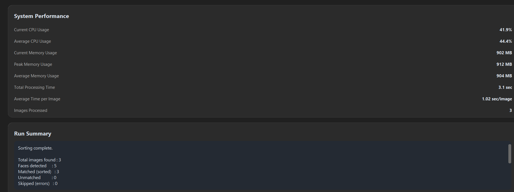

# KinderSort User Guide

## 1. Introduction

Welcome to KinderSort!

KinderSort is an AI-powered desktop application that automatically sorts classroom event photos into individual student folders using face detection and face recognition.

This version has been optimized with InsightFace (SCRFD + ArcFace), features a modern CustomTkinter interface, and includes real-time system performance monitoring. It is designed to run efficiently on a standard Windows computer without requiring a dedicated GPU.

---

# 2. System Requirements

Before running the application, please ensure your computer meets the following requirements:

- Windows 10 or Windows 11
- CPU (No dedicated GPU required)
- At least 8 GB RAM (16 GB recommended)
- Approximately 2 GB of available disk space

---

# 3. Starting the Application

1. Double-click **KinderSort.exe**.
2. Wait for the application to finish loading.
3. The main window will appear.

---

# 4. Understanding the Interface

The application consists of three folder selections:

### Reference Folder

Contains one clear face photo for each student.

Example:

Reference

├── Alice.jpg

├── Ben.jpg

├── Charlie.jpg

---

### Classroom Folder

Contains classroom or activity photos.

Example:

Classroom

├── IMG001.jpg

├── IMG002.jpg

├── IMG003.jpg

---

### Output Folder

The application will automatically generate the sorting results here.

---

# 5. Selecting the Reference Folder

1. Click **Browse** next to Reference Folder.
2. Select the folder containing students' reference photos.
3. Confirm your selection.

---

# 6. Selecting the Classroom Folder

1. Click **Browse** next to Classroom Folder.
2. Select the folder containing classroom event photos.

---

# 7. Selecting the Output Folder

1. Click **Browse** next to Output Folder.
2. Choose where the sorted photos should be saved.

---

# 8. Starting the Sorting Process

After all folders have been selected:

1. Click **Start Sorting**.
2. The application will begin processing photos.
3. A progress bar will display the current progress.

Please wait until processing is complete.

---

# 9. Understanding the Performance Panel

During processing, the system displays performance statistics.

Information may include:

- CPU Usage
- Memory Usage
- Processing Time
- Images Processed

These statistics help monitor the application's resource usage.

---

# 10. Viewing the Results

After processing is complete, the output folder will contain:

Output

├── Alice

├── Ben

├── Charlie

└── Unmatched

Each student's folder contains photos where the student was detected.

Photos that do not match any reference face are placed in the **Unmatched** folder.

---

# 11. Tips for Best Results

For better recognition accuracy:

- Use one clear reference photo for each student.
- Ensure the face is clearly visible.
- Avoid blurry images.
- Use photos with good lighting.
- Avoid heavily covered faces.
- Ensure each reference photo contains only one person.

---

# 12. Common Issues

## No faces detected

Possible causes:

- Image is blurry.
- Face is too small.
- Face is blocked.

Solution:

Use clearer images with visible faces.

---

## Some students are placed in Unmatched

Possible causes:

- Low image quality.
- Face angle is too large.
- Lighting conditions are poor.

Solution:

Replace the student's reference photo with a clearer frontal image.

---

## Application starts slowly

This application loads AI models during startup.

The first launch may take several seconds.

This is normal.

---

# 13. Frequently Asked Questions

## Does this application require a GPU?

No.

KinderSort is optimized to run entirely on CPU.

---

## Can one photo contain multiple students?

Yes.

The application detects multiple faces within a single image and attempts to match each face with the reference photos.

---

## Where are unmatched photos stored?

They are automatically placed inside the **Unmatched** folder.

---

## Can I run the application without Python?

Yes.

The packaged executable (KinderSort.exe) allows users to run the application without installing Python.

---

# 14. Conclusion

Thank you for using KinderSort.

We hope this application helps teachers organize classroom photos more efficiently while reducing manual sorting time.
